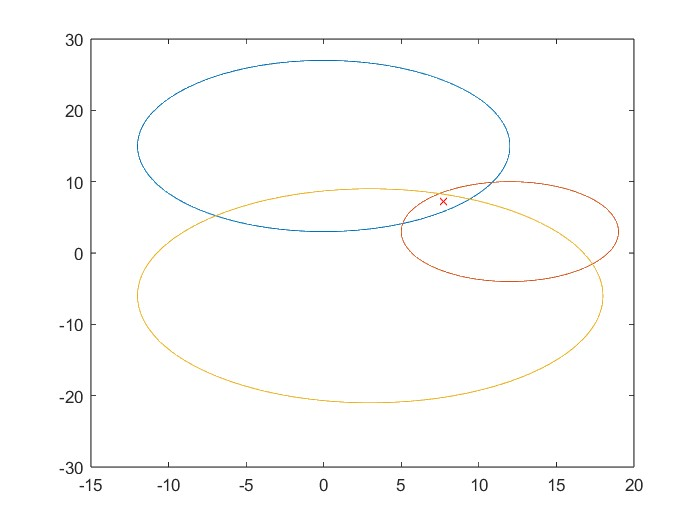

# satellite navigation and communiation

 

This repo contains a very small matlab code example for GNSS position based on least square triangulation with time of arrival measurements in two dimensions.
It uses three satellites to determine the receiver position [x,y] and clock bias [b].
